# Task Vantage Demo


Task Vantage Demo is a reference implementation showcasing a modern task management platform exposed through multiple interfaces:

- 🚀 **REST API** - Built with [Hono](https://hono.dev/) and secured with Auth0 JWT validation
- 🔌 **MCP Server** - Model Context Protocol server using [Hono](https://hono.dev/) + [mcp-handler](https://www.npmjs.com/package/mcp-handler) with Custom Token Exchange
- 🤖 **Agent Service** - AI agent with web-based chat interface using [LlamaIndex](https://github.com/jerryjliu/llama_index) and Google Gemini
- 📱 **Web Application** - Modern web interface for direct project and task management

**User Access Points:**
- 🖥️ **Claude Desktop** → MCP Server (AI assistant integration)
- 🌐 **Web Browser** → Agent Service (AI chat interface)
- 🌐 **Web Browser** → Web Application (traditional task management UI)

> **Learn more**: See [docs/ABOUT.md](./docs/ABOUT.md) for the product vision and background.

## 📚 Documentation

| Document | Description |
|----------|-------------|
| [docs/LOGGING.md](docs/LOGGING.md) | Verbose logging system for debugging authentication flows |
| [docs/VERCEL.md](docs/VERCEL.md) | Complete deployment guide for Vercel serverless functions |
| [docs/ABOUT.md](./docs/ABOUT.md) | Product vision and Task Vantage overview |

## 🏗️ Project Structure

```
src/
├── 🚀 api/          # REST API (Hono + Auth0)
├── 🔌 mcp/          # MCP Server (Hono + mcp-handler + CTE)
├── 🤖 agent/        # Agent Service (Hono + LlamaIndex + Gemini)
├── 📱 webapp/       # Web Application (Hono + Auth0 OAuth2)
└── 🛠️ utils/        # Shared utilities (logging, etc.)

vercel/              # Deployment configurations
├── api/            # API service deployment
├── mcp/            # MCP service deployment
├── agent/          # Agent service deployment
└── webapp/         # Web app deployment
```  

## ⚡ Quick Start

### Requirements
- **Node.js 22+**
- **npm** (or compatible package manager)
- **Auth0 account** (for authentication)
- **Google API key** (for AI agent functionality)  

### Installation

1. **Install dependencies:**
   ```bash
   npm install
   ```

2. **Configure environment:**
   ```bash
   cp .env.example .env
   # Edit .env with your Auth0 and Google API credentials
   ```

3. **Start all services:**
   ```bash
   npm run dev:all
   ```

## Available Scripts

### Development

```bash
# Run individual services
npm run dev:api        # Start REST API (port 8787)
npm run dev:mcp        # Start MCP server (port 8080)
npm run dev:agent      # Start Agent service (port 3000)
npm run dev:webapp     # Start Web App (port 3001)

# Development with file watching
npm run dev:agent:watch   # Auto-restart agent on file changes
npm run dev:webapp:watch  # Auto-restart webapp on file changes

# Run all services in parallel
npm run dev:all        # Starts all 4 services + opens browser tabs
npm start              # Alias for dev:all

# Open services in browser
npm run open:agent     # Opens http://localhost:3000
npm run open:webapp    # Opens http://localhost:3001
```

### Deployment (Vercel)

```bash
# Bootstrap Vercel projects (first time setup)
npm run bootstrap:all     # Link all 4 Vercel projects
npm run bootstrap:api     # Link task-vantage-api project
npm run bootstrap:mcp     # Link task-vantage-mcp project
npm run bootstrap:agent   # Link task-vantage-agent project
npm run bootstrap:webapp  # Link task-vantage-webapp project

# Deploy services
npm run deploy:all        # Deploy all services sequentially
npm run deploy:parallel   # Deploy all services in parallel
npm run deploy:api        # Deploy API service only
npm run deploy:mcp        # Deploy MCP service only
npm run deploy:agent      # Deploy Agent service only
npm run deploy:webapp     # Deploy Web App service only
```

### Monitoring

```bash
# View deployment logs
npm run logs:all          # View logs for all services
npm run logs:api          # View API service logs
npm run logs:mcp          # View MCP service logs
npm run logs:agent        # View Agent service logs
npm run logs:webapp       # View Web App service logs

# Open deployed services in browser
npm run open:deployed:all     # Open all service dashboards
npm run open:deployed:api     # Open API service dashboard
npm run open:deployed:mcp     # Open MCP service dashboard
npm run open:deployed:agent   # Open Agent service dashboard
npm run open:deployed:webapp  # Open Web App service dashboard
```

> **See [VERCEL.md](docs/VERCEL.md) for detailed deployment instructions.**

### Service URLs (Local Development)

| Service | URL | Purpose |
|---------|-----|----------|
| 🚀 **API** | http://localhost:8787 | REST API endpoints |
| 🔌 **MCP** | http://localhost:8080/mcp | MCP server endpoint (Claude Desktop) |
| 🤖 **Agent** | http://localhost:3000 | AI chat interface (Web Browser) |
| 📱 **Web App** | http://localhost:3001 | Task management interface (Web Browser) |

### Key Routes

- **Agent Chat Interface**: http://localhost:3000/chat/app (AI chat via web browser)
- **Web App Dashboard**: http://localhost:3001/app (Task management interface)
- **API Health**: http://localhost:8787/health
- **MCP Health**: http://localhost:8080/health

## 🔐 Authentication Flow

Task Vantage uses **Auth0** for authentication with different flows per service:

| Service | Auth Method | Token Type |
|---------|------------|------------|
| **REST API** | JWT validation | Bearer `access_token` |
| **MCP Server** | Custom Token Exchange (CTE) | Bearer → API token |
| **Agent Service** | OAuth2 sessions | Session + Bearer tokens |
| **Web App** | OAuth2 Authorization Code | Session + Access tokens |

> **Details**: See sequence diagram below for complete authentication flow.

## 🔧 Environment Configuration

**Quick setup:**
```bash
cp .env.example .env
# Edit .env with your credentials
```

### Service-Specific Configuration

Each service has its own configuration documented in its README:

| Service | Configuration Guide |
|---------|---------------------|
| 🚀 **API Service** | [src/api/README.md](src/api/README.md) |
| 🔌 **MCP Service** | [src/mcp/README.md](src/mcp/README.md) |
| 🤖 **Agent Service** | [src/agent/README.md](src/agent/README.md) |
| 📱 **Web App Service** | [src/webapp/README.md](src/webapp/README.md) |

### Global Configuration

All services use these shared Auth0 settings:

* `AUTH0_DOMAIN` - Your Auth0 domain (e.g., your-domain.auth0.com)
* `LOG_VERBOSE` - Enable verbose logging for debugging (default: true)

> **Note**: REDIS_URL is automatically provided by Vercel for deployed services. Only configure locally if using local Redis.

## 🏛️ System Architecture

### High-Level Overview

The diagram shows how all Task Vantage services work together:

```mermaid
flowchart TB
%% User interactions
    User(["End User"])
    Claude(["Claude Desktop<br/>with MCP"])
    Browser(["Web Browser"])

%% Services (can run locally or on Vercel)
    subgraph Services["Task Vantage Services"]
        direction TB

        WebApp["📱 Task Vantage Web<br/>(Hono + Auth0 + Session)"]:::webapp
        Agent["🤖 Task Vantage Agent<br/>(LlamaIndex + Gemini)"]:::agent
        MCP["🔌 Task Vantage MCP<br/>(Hono + mcp-handler + CTE)"]:::mcp
        API["🚀 Task Vantage API<br/>(Hono + JWT validation)"]:::api

        Store["💾 In-memory Store<br/>(Projects, Tasks, Tags, Comments)"]:::store
    end

%% External services
    subgraph External["External Services"]
        Auth0["🔐 Auth0<br/>(Identity Provider)"]:::auth
        Gemini["🧠 Google Gemini<br/>(LLM Provider)"]:::gemini
    end

%% User flows
    User -.-> Browser
    User -.-> Claude
    Browser --> WebApp
    Browser --> Agent
    Claude --> MCP

%% Service interactions
    WebApp --> API
    Agent --> MCP
    MCP --> API
    API --> Store
    Agent --> Gemini

%% Authentication flows
    WebApp --> Auth0
    Agent --> Auth0
    MCP --> Auth0
    API --> Auth0

%% styles
    classDef webapp fill:#FFF2E6,stroke:#FF8C00,color:#8B4513,stroke-width:2px
    classDef agent fill:#EAF2F8,stroke:#5DADE2,color:#1B4F72,stroke-width:2px
    classDef mcp fill:#F5EEF8,stroke:#BB8FCE,color:#4A235A,stroke-width:2px
    classDef api fill:#FCF3CF,stroke:#F1C40F,color:#7D6608,stroke-width:2px
    classDef store fill:#D5F5E3,stroke:#27AE60,color:#145A32,stroke-width:2px
    classDef auth fill:#FADBD8,stroke:#E74C3C,color:#641E16,stroke-width:2px
    classDef gemini fill:#E8F5E8,stroke:#28A745,color:#155724,stroke-width:2px
```



### Unified Hono Architecture

**Key Benefits:**
- ✨ **Consistent Framework**: All services use [Hono](https://hono.dev/) for maximum code reuse and maintainability
- 🚀 **Vercel Optimized**: Native serverless function support with zero configuration
- 🔄 **DRY Deployment**: Same codebase structure across local development and production
- 🔐 **Unified Auth Patterns**: Consistent Auth0 integration across all services

This diagram shows the specific frameworks and technologies used in each service:

```mermaid
flowchart TB
    subgraph "🏗️ Technology Stack"
        direction TB

        subgraph WebApp ["📱 Task Vantage Web"]
            WA1["Hono Framework"]
            WA2["@auth0/auth0-hono"]
            WA3["OAuth2 Authorization Code"]
        end

        subgraph Agent ["🤖 Task Vantage Agent"]
            AG1["Hono Framework"]
            AG2["@auth0/auth0-hono"]
            AG3["LlamaIndex + @llamaindex/google"]
            AG4["Session Management"]
        end

        subgraph MCP ["🔌 Task Vantage MCP"]
            MC1["Hono Framework"]
            MC2["mcp-handler"]
            MC3["@auth0/auth0-api-js"]
            MC4["Custom Token Exchange"]
        end

        subgraph API ["🚀 Task Vantage API"]
            AP1["Hono Framework"]
            AP2["@auth0/auth0-api-js"]
            AP3["JWT Validation"]
            AP4["In-memory Store"]
        end

        subgraph External ["🌐 External Services"]
            EX1["Auth0 Identity Provider"]
            EX2["Google Gemini API"]
        end
    end

    %% Framework relationships
    WebApp --> API
    Agent --> MCP
    MCP --> API

    %% Auth flows
    WebApp --> External
    Agent --> External
    MCP --> External
    API --> External

    %% Agent AI integration
    Agent --> EX2

    %% Styling
    classDef webapp fill:#FFF2E6,stroke:#FF8C00,color:#8B4513,stroke-width:2px
    classDef agent fill:#EAF2F8,stroke:#5DADE2,color:#1B4F72,stroke-width:2px
    classDef mcp fill:#F5EEF8,stroke:#BB8FCE,color:#4A235A,stroke-width:2px
    classDef api fill:#FCF3CF,stroke:#F1C40F,color:#7D6608,stroke-width:2px
    classDef external fill:#FADBD8,stroke:#E74C3C,color:#641E16,stroke-width:2px

    class WebApp,WA1,WA2,WA3 webapp
    class Agent,AG1,AG2,AG3,AG4 agent
    class MCP,MC1,MC2,MC3,MC4 mcp
    class API,AP1,AP2,AP3,AP4 api
    class External,EX1,EX2 external
```



## 🔄 Request Flow

This sequence shows how Claude Desktop creates a task via MCP:


