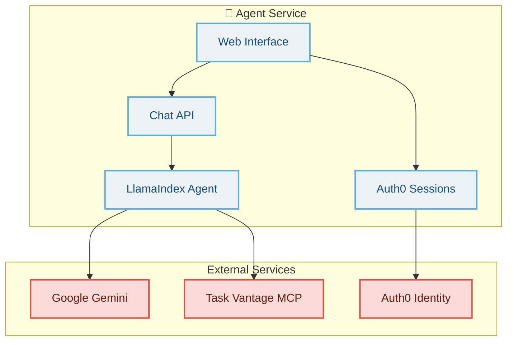

# 🤖 Task Vantage Agent Service

AI-powered chat interface for Task Vantage, built with [LlamaIndex](https://github.com/jerryjliu/llama_index) + [Hono](https://hono.dev/) with Auth0 session management and MCP integration.

**Local Development**: `http://localhost:3000`
**Production**: Deployed to Vercel as serverless functions
**Chat Interface**: `/chat/app` (authenticated) or `/` (public)

## 🤖 Features

### AI Chat Interface
- **Interactive Web UI**: Modern chat interface for conversing with the AI agent
- **Google Gemini Integration**: Powered by Google's Gemini 2.0 Flash model
- **Real-time Communication**: RESTful API endpoints for seamless chat functionality
- **Session Persistence**: Maintains conversation context across requests

### Task Vantage Integration
- **MCP Server Connection**: Direct integration with Task Vantage MCP server
- **Dynamic Tool Loading**: Automatically discovers and loads all available MCP tools
- **Full Project Management**: Complete access to projects, tasks, comments, and tags
- **Graceful Fallback**: Built-in mathematical tools when MCP server is unavailable

### Authentication & Security
- **Auth0 Sessions**: Secure session-based authentication for web interface
- **Protected Routes**: `/chat/app` requires authentication, `/` is public
- **Token Forwarding**: Passes user tokens to MCP server for authenticated API calls
- **Flexible Auth**: Falls back to no-auth mode when Auth0 not configured

## 🔧 Environment Configuration

### Required Variables

* `GOOGLE_API_KEY` - Google API key for Gemini model - **Required for AI functionality**
* `AUTH0_DOMAIN` - Your Auth0 domain (e.g., your-domain.auth0.com) - **Shared across all services**

### Auth0 Variables (Optional - enables authentication)

* `AGENT_AUTH0_CLIENT_ID` - Auth0 client ID for agent service (Regular Web Application)
* `AGENT_AUTH0_CLIENT_SECRET` - Auth0 client secret for agent service
* `AGENT_SESSION_SECRET` - Session secret for secure cookies (generate with `openssl rand -hex 32`)

### Optional Variables

* `AGENT_PORT` - Agent server port (default: `3000`)
* `AGENT_BASE_URL` - Base URL for Auth0 callbacks (default: `http://localhost:3000`)
* `MCP_BASE_URL` - Base URL for MCP service (default: `http://localhost:8080`)
* `MCP_AUTH0_AUDIENCE` - API audience for MCP token forwarding

### Authentication Detection

The service automatically detects authentication configuration:
- ✅ **Auth Enabled**: All Auth0 variables are set - `/chat/app` requires login
- ⚠️ **No Auth Mode**: Missing Auth0 variables - all routes are public

## 🏗️ Architecture

The agent integrates multiple services for comprehensive AI-powered task management:



### Component Flow
1. **Web Interface**: Users interact via web-based chat UI
2. **Auth0 Sessions**: Handles login/logout and session management
3. **Chat API**: Processes messages and manages conversation context
4. **LlamaIndex Agent**: Orchestrates AI responses and tool execution
5. **MCP Integration**: Dynamically loads and executes Task Vantage tools
6. **Google Gemini API**: Provides language model inference via Gemini 2.0 Flash

## 🛠️ Available Tools

### Built-in Mathematical Tools
- `sumNumbers(a, b)` - Add two numbers together
- `divideNumbers(a, b)` - Divide one number by another

### Task Vantage MCP Tools (Dynamic)
The agent automatically discovers all tools from the MCP server:
- **Project Tools**: Create, list, and search projects
- **Task Tools**: Full CRUD operations on tasks
- **Status Management**: Update task status (todo/in_progress/done)
- **Assignment Tools**: Assign tasks to users
- **Comment Tools**: Add comments to tasks
- **Tag Management**: Add/remove tags from tasks
- **Due Date Tools**: Find tasks due soon

## 🚀 Development

### Quick Start
```bash
# Install dependencies
npm install

# Configure environment
cp .env.example .env
# Edit .env with your GOOGLE_API_KEY and Auth0 credentials

# Start agent service
npm run dev:agent

# Visit the interface
open http://localhost:3000
```

### Routes

| Route | Authentication | Description |
|-------|---------------|-------------|
| `/` | Public | Landing page with basic chat interface |
| `/chat/app` | **Protected** | Full-featured authenticated chat interface |
| `/api/chat` | Session-based | Chat API endpoint |
| `/callback` | Auth0 | OAuth callback handling |
| `/logout` | Auth0 | Session logout |

### Chat API Endpoint

**POST /api/chat**
```bash
curl -X POST http://localhost:3000/api/chat \
  -H "Content-Type: application/json" \
  -d '{"message": "Create a project called Demo"}'
```

**Response:**
```json
{
  "response": "I've created the 'Demo' project for you.",
  "context": {
    "userId": "auth0|user-id",
    "orgId": "demo-org"
  }
}
```

### MCP Server Configuration

The agent expects the MCP server to be available at `http://localhost:8080/mcp`. The connection is configured in `src/agent/index.ts`:

```typescript
const mcpClient = await createMCPClient({
  url: MCP_BASE_URL + '/mcp',
  verbose: true
});
```

## 🔐 Auth0 Configuration

### Application Setup
1. **Create Application**: Regular Web Application in Auth0 Dashboard
2. **Configure URLs**:
   - **Allowed Callback URLs**: `http://localhost:3000/callback`
   - **Allowed Logout URLs**: `http://localhost:3000`
   - **Allowed Web Origins**: `http://localhost:3000`
3. **Note Credentials**: Domain, Client ID, and Client Secret

### Session Management
The agent uses secure sessions with:
- HTTP-only cookies for security
- Session encryption with `AGENT_SESSION_SECRET`
- Automatic token refresh handling
- Proper logout and session cleanup

## 📋 Usage Examples

### Basic Conversations
```
User: "Hello, what can you help me with?"
Agent: "I'm your Task Vantage assistant! I can help you manage projects and tasks..."

User: "What's 15 + 27?"
Agent: "15 + 27 = 42"
```

### Project Management
```
User: "Create a project called 'Website Redesign'"
Agent: "I've created the 'Website Redesign' project for you."

User: "Add a task 'Design homepage mockups' to the Website Redesign project"
Agent: "I've added the task 'Design homepage mockups' to your Website Redesign project."
```

### Task Operations
```
User: "Show me all tasks due this week"
Agent: "Here are your tasks due this week: [lists tasks with due dates]"

User: "Mark task #123 as in progress"
Agent: "I've updated task #123 status to 'in progress'."
```

## 🔍 Troubleshooting

### Common Issues

1. **Missing Google API Key**
   ```
   Error: Google API key not configured
   Solution: Set GOOGLE_API_KEY in your .env file
   ```

2. **MCP Server Connection Failed**
   ```
   Warning: Failed to connect to MCP server, using fallback tools
   Solution: Ensure MCP server is running on http://localhost:8080/mcp
   ```

3. **Auth0 Configuration Issues**
   ```
   Warning: Auth0 not configured, running with NO AUTH
   Solution: Set AUTH0_DOMAIN, AGENT_AUTH0_CLIENT_ID, AGENT_AUTH0_CLIENT_SECRET
   ```

4. **Port Already in Use**
   ```
   Error: Port 3000 already in use
   Solution: Set AGENT_PORT to a different port number
   ```

### Debug Logging

Enable verbose logging by setting environment variables:
```bash
LOG_VERBOSE=true npm run dev:agent
LOG_AGENT_SERVER=true npm run dev:agent
```

### Health Checks
```bash
# Check agent health
curl http://localhost:3000/health

# Test chat endpoint
curl -X POST http://localhost:3000/api/chat \
  -H "Content-Type: application/json" \
  -d '{"message": "hello"}'
```

## 🏭 Production Deployment

The agent service deploys to Vercel as serverless functions:

### Environment Variables (Production)
```bash
# Update base URLs for production
AGENT_BASE_URL=https://agent.taskvantage.example.com
MCP_BASE_URL=https://mcp.taskvantage.example.com

# Keep other variables the same
GOOGLE_API_KEY=your-google-api-key
AUTH0_DOMAIN=your-domain.auth0.com
# ... etc
```

### Deployment
```bash
npm run deploy:agent
```

> **Note**: Ensure Auth0 callback URLs include your production domain for proper authentication flow.